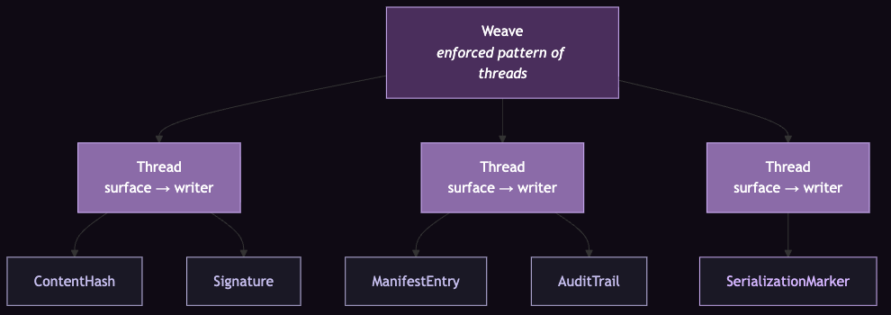
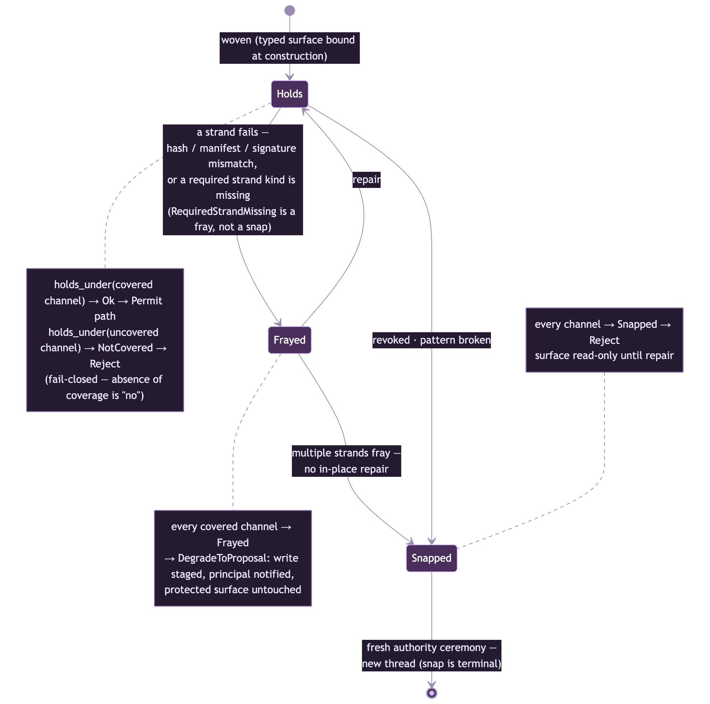

# coven-threads

**Status:** Engineering phases 0–4 are **frozen**; Phase 5 (approval semantics) is **active**. Phase 0 design FROZEN v0.2 (2026-07-14, tag `v0.2-phase0-design`); Phase 1 crate FROZEN (`threads-986.18` closed); Phase 2 daemon integration FROZEN (`threads-986.20` closed) and **merged into the coven daemon** (PR https://github.com/OpenCoven/coven/pull/382); Phase 3 C7 portability FROZEN (`threads-986.21` closed) with the envelope **decided: Shape B (`.weave`) + lossy one-way `.af` exporter** (`threads-986.16` closed); Phase 4 Cave surfaces FROZEN (2026-07-17, epic `threads-986.17` closed; coven-cave PR #3223 merged). Phase 5 opened 2026-07-18 (Val+Nova decision) under epic `threads-uqx` with spec `specs/PHASE-5-APPROVAL-SEMANTICS.md`; its Nova (`threads-uqx.9`) and Val (`threads-uqx.10`) gates are still open. 205 workspace tests green (2026-07-21). Both Phase-1/2 Val gates resolved 2026-07-15 (repo flipped public for `threads-986.19`); one earlier human gate remains — Nova on `threads-986.12` (grimoire C7 canonicalization). See [docs/phases.md](docs/phases.md) for the phase-by-phase ledger.
**License:** stated as Apache-2.0 (planned) in the design doc; the committed `LICENSE` file is currently MIT — a known discrepancy pending reconciliation (see `docs/STATUS-2026-07-15.md` §6).
**Owners (design phase):** Sage 🌿 + Echo 🔮 co-drive; Nova 👑 + Sage on lane assignments; Cody ⚡ Phase 1+ crate lane

---

## What this is

`coven-threads` is OpenCoven's **authority-boundary gate layer**: the external, structural enforcement contract that sits *above* the `coven` Rust daemon's untrusted-client boundary, and *underneath* every familiar's protected memory surface.

In the vocabulary of the Familiar Contract (RFC-0001) and the Ward v0.2 spec: this is the *gate-shaped receiver* on which Ward's four validation gates sit. Ward specifies **what** the gates check; `coven-threads` specifies **how** they are enforced, by an authority outside familiar cooperation.

It is a conforming implementation of RFC-0001 §5 — and by declaration, **RFC wins on any conflict** with this repo.

Gate 4 fail-closed is a line-one conformance property, not a hardening milestone: an implementation that allows Gate 4 to be bypassed does not conform to RFC-0001 (§5.4).

## Documentation

User-facing docs live in [`docs/`](docs/README.md):

- [Concepts](docs/concepts.md) — the vocabulary (Thread, Weave, Strand, Channel), the two-compaction contract, the descriptor-vs-predicate anti-pattern. **Read this first.**
- [Architecture](docs/architecture.md) — where this layer sits, the enforcement flow, the `ward.audit` store.
- [Authority model](docs/authority-model.md) — fail-closed, the three verdicts, the tension state machine.
- [Channels and strands](docs/channels-and-strands.md) — the four channels, the five strand kinds, WARD-C1–C7.
- [Phases](docs/phases.md) — what is frozen, what is implemented, what is active, what is blocked.
- [FAQ](docs/faq.md) · [Glossary](docs/glossary.md)

The frozen design doc is [`specs/PHASE-0-DESIGN.md`](specs/PHASE-0-DESIGN.md); the docs describe it and never amend it.

## Why this is not just "OpenTrust"

The `coven` daemon already ships an authority boundary — untrusted clients speak over a unix socket to a trusted Rust daemon that revalidates every sensitive request. That boundary is real, documented in `coven/docs/SAFETY-MODEL.md`, and works.

What is missing today: the boundary validates **who** and **what action**, but does not validate **what the requester is trying to mutate against a typed protected surface**. `coven-threads` is that missing layer. It doesn't replace the daemon; it gives the daemon a gate-shaped receiver for identity-surface mutation requests.

## The weaving metaphor

The architecture is named around the metaphor of weaving because the metaphor *does load-bearing work*, not because it sounds pretty. Every term is bound to a concrete referent at first use (design doc §2.5); the referents below are the frozen v0.2 bindings:

- **Thread** (*authority relationship: surface → writer*) — a directional line from a protected surface (SOUL.md, MEMORY.md, an identity field) to the authority that gates writes to it. One thread per `(surface, writer)` pair. Threads have **tension**: they hold, fray, or snap under load.
- **Weave** (*enforced pattern of threads across a familiar or Coven*) — the invariant that these specific threads must all hold *together* for the identity to be coherent. Ward's four gates are the **loom** the weave is made on — the fixed structure threads run through — not threads themselves.
- **Strand** (*fiber inside a thread: hash | signature | manifest entry | audit trail | serialization marker*) — the fibers that make a thread survive stress. A thread survives a channel iff its strands survive that channel; a thread **frays** when a strand fails, which is what makes failure legible.
- **Channel** (*axis of load a thread must hold under*) — `Deliberate`, `Forced`, `Serialization`, `Mutation`. Every gate check is one question: *does thread T hold under channel C?*

**Design intent of the metaphor:** a familiar's identity is not a single object protected by a single gate. It is a *woven* structure of typed protected surfaces with distinct authority relationships. The metaphor makes the multi-surface, multi-authority reality of the architecture visible instead of collapsing it into "protect SOUL.md."

## The four invariants this layer must preserve

Co-designed as *channels a weave must survive*, not stacked as features (design doc §3.3):

1. **Identity-as-memory-property** — the identity surface is a typed layer of memory, not a runtime configuration; threads bind to typed surfaces at construction time.
2. **Structural mutation authority** — the gate is external to the familiar; the familiar cannot cooperate its way past it. Enforcement is Rust-side, daemon-called.
3. **Two-compaction contract** — deliberate memory compaction (dreaming) and forced context compaction are distinct channels with distinct survival requirements; WARD-C1–C6 govern the forced channel.
4. **Survives serialization (WARD-C7)** — the authority contract must round-trip across export/import, or fail visibly. Numbered seventh so its lineage from C1–C6 stays legible; canonical home for C1–C7 jointly is the `coven-grimoire` Ward Layer Spec Brief §9.

These are non-negotiable and must be *co-designed*, not stacked — the `Channel` enum is where the type system holds them together.

## Phase plan

Honest labels; the detailed ledger is [docs/phases.md](docs/phases.md).

- **Phase 0 — design doc + beads scaffolding + repo skeleton.** ✅ **FROZEN v0.2** (2026-07-14, tag `v0.2-phase0-design`). Nova sign-off; RFC-0001 §5 round-trip verified. No enforcement code, by design.
- **Phase 1 — core crate.** `[MERGED, NOT RELEASED]` — `crates/coven-threads-core` (types, hash-manifest layer, §5 receiver, RFC-0001 §5 conformance mirror; 205 tests green as of 2026-07-21). Imported by coven `main` via `Cargo.toml` git dep at tag `v0.1.2` and called from `crates/coven-cli/src/threads_gate.rs::gate_protected_edits` on every protected-tier edit. The next coven release will include this integration; current release `v0.0.54` (2026-07-14) predates PR #382. `.18` closed.
- **Phase 2 — coven daemon integration.** `[MERGED, NOT RELEASED]` — crate-side contracts landed (`audit.rs`, `staging.rs`); daemon-side call site merged to coven `main` via PR #382 (`feat/threads-gate-validator`). Beads `.14` (epic), `.20` (FREEZE), and `.19` (merge gate — resolved by flipping this repo public) closed with evidence.
- **Phase 3 — portability contract.** C7 round-trip semantics implemented and tested (`portability` module + 17-test round-trip suite); the interchange envelope is **decided** (`threads-986.16` closed): **Shape B (`.weave`) canonical, plus a lossy one-way `.af` exporter** — see the §6 decision record in `specs/PHASE-3-PORTABILITY.md`.
- **Phase 4 — cockpit integration.** ✅ **COMPLETE, FROZEN** (2026-07-17; epic `threads-986.17` closed). CovenCave surfaces per the `specs/PHASE-4-CAVE-SURFACES.md` contract (this repo's PR #1): weave rail with tension rollup, thread pane (Holds/Frayed/Snapped), strand inspector with tri-state diff + R7 lineage, and the proposal approval flow — all merged via coven-cave PR #3223 (18 checks green, `test:app` 740/740). Gates passed: Charm voice pass (`.17.7`), Nova coherence sign-off (`.17.8`), Val UX-accept (`.17.10`), Val freeze approval (`.17.9`). Rendering rules R1–R11 enforced fail-closed. Follow-up bead: `threads-v3g` (daemon endpoints + adapter flip). Post-freeze addition: degraded-familiar surfacing (`threads-k9s` closed) — spec §2.7 `DegradedFamiliarView` + §4.R12, daemon half coven PR #422, Cave half coven-cave PR #3415, both merged.
- **Phase 5 — approval semantics.** **ACTIVE** (opened 2026-07-18 by Val+Nova decision; epic `threads-uqx`; spec `specs/PHASE-5-APPROVAL-SEMANTICS.md`). Core design commitments: the typed `ApprovalPath` (auto / familiar-review / human / human-with-rationale) is the approval-ceremony axis and is **orthogonal** to `Channel` — never derived from it; delayed-apply only (no provisional apply): a proposal stays pending-visible through its veto window and is applied only after the deadline with no veto **and** a matching evidence replay; classification and scheduling are daemon-owned; identity invariants are predicate-authoritative; every window close carries an explicit reason. Closed: `.3` core approval types (`approval.rs`), `.4` identity invariant predicates + advisory probes (`identity_invariants.rs`), `.5` `SurfaceRegionPredicate` + Gate-4 replay (`surface_regions.rs`), `.6` delayed-apply scheduler + audit (daemon-side, coven PR #430), `.11` authority review findings. In progress: `.7` Cave veto-window contract, `.12` RFC-0001 approval-tier alignment (familiar-contract PRs #3/#4). Open: `.2`, `.13`, `.8`, and the human gates — Nova coherence sign-off (`.9`), Val freeze (`.10`).

## Anti-goals

- **Not a general-purpose policy engine.** This is a *typed* authority layer for OpenCoven familiar surfaces. Reusability is a nice-to-have; typed correctness is the goal.
- **Not a runtime-portability format.** That's Phase 3's job. Phase 0 is enforcement design, not export.
- **Not `.af`-compatible.** Documented divergence, source-verified 2026-07-14: Letta's `CoreMemoryBlockSchema` has no protection field and runtime `read_only` is stripped at export — silent downgrade on import is exactly what WARD-C7 refuses. See [docs/faq.md](docs/faq.md#why-isnt-it-af-compatible).

## Related

- `coven/docs/SAFETY-MODEL.md` — authority boundary this layer sits on
- `familiar-contract/rfcs/RFC-0001-familiar-contract.md` — the contract this layer enforces (RFC wins on conflict)
- `coven-grimoire` Ward Layer Spec Brief §9 — canonical home of WARD-C1–C7
- `research/synthesis/memory-layer-comparison-opencoven-openclaw-hermes-2026-07-13.md` — comparative context

---

_First commit: 2026-07-14. Repo scaffolded in Phase 0 evening session with Val's greenlight._
