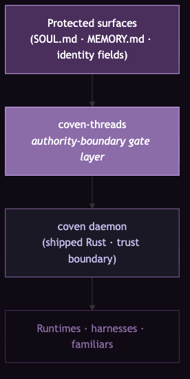

# Architecture

> Status: the enforcement flow on this page is `[DESIGNED]` (frozen, `specs/PHASE-0-DESIGN.md` §5) with the crate implementation in `coven-threads-core` and the daemon-side call site **merged to coven `main`** (PR https://github.com/OpenCoven/coven/pull/382, 2026-07-15). Daemons built from coven `main` route tier-0 protected-surface edits through this flow.

Vocabulary reminder (bound in full in [concepts.md](concepts.md)): a **Thread** is an authority relationship *surface → writer*; a **Weave** is the enforced pattern of threads across a familiar; a **Strand** is a fiber inside a thread (hash, signature, manifest entry, audit trail, serialization marker); a **Channel** is the axis of load a thread must hold under.

## Where coven-threads sits

*Protected surfaces → coven-threads → coven daemon → runtimes, harnesses, familiars. The daemon is the trust boundary; coven-threads is the typed gate layer behind it.*

The `coven` Rust daemon is the shipped trust boundary. Its safety model (`coven/docs/SAFETY-MODEL.md`, verified on disk 2026-07-14) states it plainly:

> *"The Rust daemon is the authority boundary. Every client is untrusted for enforcement purposes."*

The daemon already enforces: canonicalized `projectRoot`/`cwd` path comparison, rejection of working directories outside the project root, allowlisted harness ids, argv-only harness commands (never `sh -c`), and fail-closed handling of unknown API versions and action ids. Its runtime state lives at `~/.coven/coven.sock` (unix socket), `~/.coven/coven.sqlite3` (daemon DB), and `~/.coven/memory/archival.sqlite3` (memory store).

What the daemon does **not** do today is validate a request *against the typed authority state of the surface it targets*. It validates **who** (client identity) and **what action** (allowlisted operations) — not **whether the target surface's threads permit this write**. `coven-threads` fills exactly that gap. It does not replace the daemon; it gives the daemon a **gate-shaped receiver** for identity-surface mutation requests.

Two structural facts follow from this placement:

1. **`coven-threads` is a crate, not a service.** It is imported into the daemon and reachable *only* by the privileged daemon process — never by a familiar-controlled process. There is no socket to coven-threads, no separate process to restart, no config file a familiar could edit. This is how the layer satisfies RFC-0001 §5.1's three MUST-NOTs (a familiar must not modify the Ward file, must not restart the authority process, must not bypass gates): there is nothing familiar-reachable *to* modify, restart, or bypass.
2. **The wire format does not change.** Clients speak the same socket protocol before and after integration. The only client-visible difference (Phase 2) is a new possible outcome on mutation requests: `DegradeToProposal`.

## Relationship to RFC-0001 and to Ward

`coven-threads` is a **conforming implementation of RFC-0001 §5** (the Ward section of the Familiar Contract). The division of labor across the document family:

- **RFC-0001 §5.1** specifies *authority-layer separation* — the boundary itself, and the requirement that convention-based protection does not count. This is the external correctness anchor: **RFC wins on any conflict** with this repo. The v0.2 design freeze was gated on a verified round-trip against §5.1, §5.4, and §5.6.
- **Ward v0.2 / RFC-0001 §5.4** specifies the *four enforcement gates* — **what** to check. The gates are the loom, in weave vocabulary.
- **`coven/docs/SAFETY-MODEL.md`** documents the *shipped substrate* — the daemon boundary the gates enforce on.
- **`coven-threads`** specifies **how** the gates enforce: the typed receiver, the verdicts, the audit contract.

The design doc's framing: the boundary (§5.1) was spec'd and the daemon existed, but there was no *gate-shaped receiver* binding them. `coven-threads` is that receiver.

## The end-to-end enforcement flow

*Client → daemon → coven-threads validator → weave load → strand check under channel → Permit / DegradeToProposal / Reject → `ward.audit`.*

The flow, step by step (design doc §5):

1. An **untrusted client** sends a mutation request to the `coven` daemon over the unix socket. The client may be a familiar's harness, a tool, or anything else; for enforcement purposes it is untrusted regardless.
2. The **daemon** performs its existing checks (identity, action allowlist, path canonicalization), then — for requests that target a protected surface — calls `coven-threads::validate(weave, request)`. The request carries three facts: which **surface**, which **writer**, and which **channel** the mutation arrives on.
3. The **validator** loads the relevant weave and asks, for each affected thread, the load-bearing question: *does this thread hold under this channel?* Concretely, it checks that the thread's strands satisfy the channel's structural requirements (e.g., a `Forced`-channel mutation requires an intact `ContentHash` and `ManifestEntry`; see [channels-and-strands.md](channels-and-strands.md)). It also checks weave coherence via the pattern **predicate** — never the descriptor (see the anti-pattern in [concepts.md](concepts.md#the-descriptor-vs-predicate-anti-pattern)).
4. The validator returns one of **three verdicts**: `Permit`, `DegradeToProposal`, or `Reject`. The semantics of each are covered in [authority-model.md](authority-model.md); the short version is: intact thread → permit; frayed thread → stage the write as a proposal for the principal, touch nothing; snapped or missing thread, or *any unknown* → reject.
5. The **daemon acts on the verdict** — applying the write, staging it to `~/.coven/pending/`, or refusing — and **appends the outcome to `ward.audit`**.

Note the shape: the validator computes; the daemon acts. `coven-threads-core` has no filesystem side effects, no audit writes, no staging I/O. It answers the gate question and names the verdict; everything with side effects is the daemon's lane. This keeps the enforcement core small, testable, and free of ambient authority.

Fail-closed is pervasive at every step (RFC-0001 §5.4 Gate 4 conformance, stated at line one of the design doc): unknown surface → Reject; protected surface with no thread → Reject; unknown channel → Reject; validator panic → the daemon treats it as Reject with a diagnostic. There is no "unknown → allow" path anywhere in the flow.

## The `ward.audit` store

**One store.** This is a Nova non-negotiable (design doc §3.4): `ward.audit` is a **table inside the daemon's existing `coven.sqlite3`**, reachable through the existing socket, daemon-owned. Not a sidecar file. Not a second database. Two audit stores would mean two sources of audit truth, and drift between them would be exactly the kind of silent divergence this layer exists to prevent.

The rationale stacks three facts:

- WARD-C6 (the compaction ledger invariant) requires every compaction event to append to `ward.audit`.
- RFC-0001 §5.6 defines the audit-log entry shape, including `ward_hash`, and requires append-only behavior: entries MUST NOT be deleted or modified.
- The daemon already owns `coven.sqlite3`, so putting the table there inherits the existing ownership and access boundary for free.

Every gate verdict is auditable, and WARD-C6's compaction ledger rides the same table rather than a second store. The implemented contract (`audit.rs`, `[IMPLEMENTED, NOT ENFORCING]`) mirrors RFC-0001 §5.6's event vocabulary (`proposal_submitted`, `proposal_approved`, `proposal_rejected`, `proposal_vetoed`, `ward_updated`) and adds the coven-threads extensions (gate verdicts, compaction ledger entries). One implementation note: the SQL table is spelled `ward_audit`, because a literal dot in the name would collide with SQLite's attached-database syntax — and an attached `ward.*` database would *be* the forbidden sidecar. Fresh init and the legacy→v0.2.0 migration both run exact pre- and postcondition guards inside `BEGIN IMMEDIATE`, so callers only commit exact `current_v020` and must `ROLLBACK` on any drift.

## Compatibility contract

From the frozen design (§6), the promises to the rest of the repo family:

- **`coven`** — coven-threads imported as a crate; zero socket-protocol changes through Phase 2; validation calls added *inside* existing request handling; clients see an identical wire format plus the new `DegradeToProposal` outcome.
- **`familiar-contract`** — conforming implementation of RFC-0001 §5, version pin v0.2.0+; RFC wins on conflict.
- **`coven-cave`** — consumes state via the daemon HTTP API; new weave/thread/strand inspection endpoints arrive in Phase 4; no breaking changes before then.
- **`coven-grimoire`** — Ward Layer Spec Brief §9 is the normative reference for the compaction invariants; coven-threads inherits WARD-C1–C6 by reference, and C7 is a numbered addition canonicalized there, not a replacement.

## Where to go next

- The verdicts and the tension state machine: [authority-model.md](authority-model.md)
- What each channel demands of a thread's strands: [channels-and-strands.md](channels-and-strands.md)
- What's actually built vs designed: [phases.md](phases.md)
