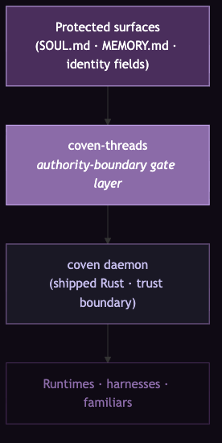

# Architecture

> Status: the Phase-0 contract is frozen, and the original daemon call site merged through OpenCoven/coven#382. The required flow below is not certification of every current route. Four Phase-5 remediation gates remain open; consult the [delivery ledger](phases.md).

Vocabulary reminder (bound in full in [concepts.md](concepts.md)): a **Thread** is an authority relationship *surface → writer*; a **Weave** is the enforced pattern of threads across a familiar; a **Strand** is a fiber inside a thread (hash, signature, manifest entry, audit trail, serialization marker); a **Channel** is the axis of load a thread must hold under.

## Where coven-threads sits

*Protected surfaces → coven-threads → coven daemon → runtimes, harnesses, familiars. The daemon is the trust boundary; coven-threads is the typed gate layer behind it.*

The `coven` Rust daemon is the shipped trust boundary. Its safety model (`coven/docs/SAFETY-MODEL.md`, verified on disk 2026-07-14) states it plainly:

> *"The Rust daemon is the authority boundary. Every client is untrusted for enforcement purposes."*

The daemon already enforces: canonicalized `projectRoot`/`cwd` path comparison, rejection of working directories outside the project root, allowlisted harness ids, argv-only harness commands (never `sh -c`), and fail-closed handling of unknown API versions and action ids. Its runtime state lives at `~/.coven/coven.sock` (unix socket), `~/.coven/coven.sqlite3` (daemon DB), and `~/.coven/memory/archival.sqlite3` (memory store).

The daemon imports Threads to validate requests against the typed authority state of their target surfaces. Coven `v0.4.3` includes the earlier integration, but complete route, identity-predicate, and replay enforcement remains subject to the unresolved [Phase-5 findings](phases.md#phase-5--approval-semantics-active). Threads supplies the **gate-shaped receiver**; it does not replace the daemon's trust boundary or own effects.

Two structural facts follow from this placement:

1. **`coven-threads` is a crate, not a service.** Any program can call the public library, but a client-side result grants no authority. Only the trusted daemon's validation of authoritative inputs can govern its effects. There is no separate Threads socket or process. RFC-0001 §5.1's separation requirements depend on daemon authentication and deployment isolation, not on hiding the crate from familiar-controlled code.
2. **The wire format does not change.** Clients speak the same socket protocol before and after integration. The only client-visible difference (Phase 2) is a new possible outcome on mutation requests: `DegradeToProposal`.

## Relationship to RFC-0001 and to Ward

`coven-threads` defines validator contracts for **RFC-0001 §5** (the Ward section of the Familiar Contract). Full daemon conformance remains subject to the delivery ledger's unresolved boundary findings. The division of labor across the document family:

- **RFC-0001 §5.1** specifies *authority-layer separation* — the boundary itself, and the requirement that convention-based protection does not count. This is the external correctness anchor: **RFC wins on any conflict** with this repo. The v0.2 design freeze was gated on a verified round-trip against §5.1, §5.4, and §5.6.
- **Ward v0.2 / RFC-0001 §5.4** specifies the *four enforcement gates* — **what** to check. The gates are the loom, in weave vocabulary.
- **`coven/docs/SAFETY-MODEL.md`** documents the *shipped substrate* — the daemon boundary the gates enforce on.
- **`coven-threads`** specifies **how** the gates enforce: the typed receiver, the verdicts, the audit contract.

The design doc's framing: the boundary (§5.1) was spec'd and the daemon existed, but there was no *gate-shaped receiver* binding them. `coven-threads` is that receiver.

## The end-to-end enforcement flow

*Historical Phase-2 diagram. Its staging branch is not permission to stage or approve protected targets. The steps below state the current required contract.*

The flow, step by step (design doc §5):

1. An **untrusted client** sends a mutation request to the `coven` daemon over the unix socket. The client may be a familiar's harness, a tool, or anything else; for enforcement purposes it is untrusted regardless.
2. The **daemon** performs its existing checks (identity, action allowlist, path canonicalization), then supplies the weave and a `MutationRequest` to `coven_threads_core::validate_fail_closed(&weave, &request)`. The request contains `surface`, `writer`, `channel`, and optional `identity_context`. Identity-aware patterns reject absent, stale, or inconsistent identity evidence.
3. The **validator** checks the supplied weave and asks: *does this thread hold under this channel?* It checks writer binding, channel coverage, tension, and structural strand requirements (for example, `Forced` requires `ContentHash` and `ManifestEntry`). The daemon verifies strand content against the world; the crate checks the resulting state. When the thread holds, the validator also checks weave coherence via the pattern **predicate**, never the descriptor.
4. The validator returns one of **three verdicts**: `Permit`, `DegradeToProposal`, or `Reject`. [The authority model](authority-model.md) explains the conditions; tension alone does not determine the verdict. A degradation never grants write authority. Only proposal-eligible targets may enter staging: proposals touching protected surfaces MUST be rejected and cannot be promoted through `ApprovalPath`.
5. The **daemon acts on the verdict** — applying the write, staging it to `~/.coven/pending/`, or refusing — and **appends the outcome to `ward.audit`**.

Note the shape: the validator computes; the daemon acts. `coven-threads-core` has no filesystem side effects, no audit writes, no staging I/O. It answers the gate question and names the verdict; everything with side effects is the daemon's lane. This keeps the enforcement core small, testable, and free of ambient authority.

Fail-closed is pervasive at every step (RFC-0001 §5.4 Gate 4 conformance, stated at line one of the design doc): unknown surface → Reject; protected surface with no thread → Reject; unknown channel → Reject; validator panic → the daemon treats it as Reject with a diagnostic. There is no "unknown → allow" path anywhere in the flow.

## The `ward.audit` store

**One store.** This is a Nova non-negotiable (design doc §3.4): `ward.audit` is a **table inside the daemon's existing `coven.sqlite3`**, reachable through the existing socket, daemon-owned. Not a sidecar file. Not a second database. Two audit stores would mean two sources of audit truth, and drift between them would be exactly the kind of silent divergence this layer exists to prevent.

The rationale stacks three facts:

- WARD-C6 (the compaction ledger invariant) requires every compaction event to append to `ward.audit`.
- RFC-0001 §5.6 defines the audit-log entry shape, including `ward_hash`, and requires append-only behavior: entries MUST NOT be deleted or modified.
- The daemon already owns `coven.sqlite3`, so putting the table there inherits the existing ownership and access boundary for free.

Every gate verdict is auditable, and WARD-C6's compaction ledger uses the same table rather than a second store. The implemented contract in `audit.rs` defines RFC-0001 §5.6's event vocabulary (`proposal_submitted`, `proposal_approved`, `proposal_rejected`, `proposal_vetoed`, `ward_updated`) and the Threads extensions, including gate verdicts, compaction entries, and Phase-5 window details. The daemon owns writes; the crate defines their contract. The SQL table is spelled `ward_audit`: a literal dot would collide with SQLite's attached-database syntax, and a separate attached audit database would violate the one-store requirement.

## Phase 5: approval semantics and delayed apply

> Status: Phase 5 is **open, not frozen** (opened 2026-07-18 by Val + Nova decision; epic `threads-uqx`). The core types shipped in `coven-threads-core` v0.2.0 (`approval.rs`, `identity_invariants.rs`, `surface_regions.rs`, and the audit-detail types in `audit.rs`). The daemon-side classification and delayed-apply scheduler landed in the coven daemon via PR https://github.com/OpenCoven/coven/pull/430. The authoritative decision record is `specs/PHASE-5-APPROVAL-SEMANTICS.md`; this page describes it and does not amend it.

Phase 2 could say a surface was "reviewed" or "logged." Phase 5 restores the distinction RFC-0001 §5.3 still names: *which promotion ceremony* must clear before the daemon applies a staged proposal. It changes nothing in the enforcement flow above — the three verdicts and the gate question are frozen Phase 0. Phase 5 governs what happens *after* a proposal is staged.

### Division of labor: this crate defines the contract, the daemon executes

The placement rule from the top of this page carries straight through. `coven-threads-core` provides the types and the contract:

- **`ApprovalPath`** — the ceremony lattice, mirroring the RFC-0001 §5.3 tiers: `AutoRegression` < `FamiliarCoherence` < `HumanApproval` < `HumanApprovalWithRationale`. The wire display labels (`auto`, `familiar_review`, `human_review`, `human_required`) are a **daemon wire contract**, not a client convention: `ApprovalPathWireEnvelope` validates the variant ↔ label round-trip at load, and an unmappable label rejects at load. Clients render exactly what the daemon sends.
- **`VetoWindow`** — a duration plus a `min_visible` floor; a window may not close before the proposal has been visibly pending for at least `min_visible`, because a veto window is only fail-closed if a human could actually have acted on it.
- **`ProposalClassification`** — the append-only record produced at intake: the channel the mutation arrived on, affected surfaces and semantic regions, the floor path tier, the required approval path (highest ceremony of everything touched wins, all-or-nothing — matching existing Ward behavior), and the **`evidence_replay_hash`** committing to the gate evidence evaluated at classification.
- **`WindowCloseReason`** and the audit-detail shapes for the lifecycle rows below.

The **daemon** owns proposal classification and the delayed-apply scheduler, initially merged through OpenCoven/coven#430 (`threads-uqx.6`). This crate defines the record the scheduler must honor. Initial delivery does not close the later route, identity, terminal, and recovery findings.

### The delayed-apply flow

*Windowed path: intake → classify → stage pending → window opens → deadline fires → live revalidation → apply or reject. No windowed path writes before its deadline and minimum-visible floor are satisfied.*

The flow (spec decision 2 — delayed apply *only*):

1. **Intake.** A proposal arrives for proposal-eligible targets. Reject any proposal whose declared or materialized diff touches a protected surface. Principal-authorized protected updates use a separate audited authority path, never this pipeline.
2. **Classify.** The daemon produces the `ProposalClassification`, including `evidence_replay_hash`.
3. **Stage pending.** Nothing is written to any protected surface.
4. **Window opens, if required.** Windowed proposals become pending-visible and must satisfy the minimum-visible floor before deadline-driven apply.
5. **Deadline fires.** Deadline expiry is a *trigger for revalidation*, not an outcome by itself.
6. **Replay.** The daemon re-derives the evidence by live re-materialization. Apply requires matching evidence, no veto, elapsed deadline and minimum visibility, and final authority revalidation. Divergence rejects.

`AutoRegression { veto: None }` has no veto period. `HumanApproval` and `HumanApprovalWithRationale` wait for explicit approval rather than a veto-window deadline. These non-windowed paths still require final live revalidation. The flow above describes the required contract, not proof that every daemon route currently satisfies it.

The [2026-09-11 readiness review](reviews/2026-09-11-landscape-and-readiness.md#phase-5-engineering-review)
identifies two specific acceptance gaps at the inspected draft: its supported
scheduled producer cannot produce `AutoRegression` with the built-in region
floors, and the diff/region replay hash does not itself bind identity
predicate evidence at classification. Later live checks and final-commit
binding do not, by themselves, close those obligations.

There is **no provisional apply, ever**: the daemon never applies first and rolls back on veto. And Gate 4 keeps its fail-closed posture unweakened — every path, windowed or not, ends in live daemon re-materialization before apply.

One conflation to refuse, because it was a HIGH finding in the independent coherence review: **Channel and ApprovalPath are orthogonal axes**, both first-class. Channel remains the frozen Phase-0 load/enforcement axis; ApprovalPath is the promotion ceremony; **never derive ApprovalPath from Channel** (spec decision 1). The binding is spelled out in [concepts.md](concepts.md#channel-vs-approvalpath-two-orthogonal-axes).

### The audit lifecycle

The windowed proposal lifecycle uses the same `ward_audit` table. Each opened window is a first-class audit interval, not a gap between rows:

`proposal_submitted` → `proposal_window_opened` → exactly one terminal close event, each close carrying an explicit `WindowCloseReason`:

| Terminal event | Close reason | Meaning |
|---|---|---|
| `proposal_approved` | `applied` | Window closed clean, replay matched, write committed |
| `proposal_vetoed` | `vetoed` | A principal veto closed the window before apply |
| `proposal_rejected` | `evidence_diverged` | Deadline replay produced a different evidence hash |
| `proposal_rejected` | `revalidation_failed` | Replay could not produce authoritative evidence |
| `proposal_rejected` | `superseded` | A newer proposal replaced this one before apply |

There is deliberately no `proposal_expired` event: expiry triggers replay; the replay's outcome is what gets recorded.

### Predicates underneath: identity invariants and surface regions

Two supporting designs feed classification, both under the same descriptor-vs-predicate discipline as `PatternPredicate` ([concepts.md](concepts.md#the-descriptor-vs-predicate-anti-pattern)):

- **Identity invariants** (`identity_invariants.rs`, bead `threads-uqx.4`) — an `IdentityInvariantDeclaration` compiles into typed predicates; the invariant *strings* are never authority. Checks are deterministic where possible and **fail closed on ambiguity** — no silent fallback to model judgment. Advisory probes (model-judgment signals) are non-gating Gate-3 evidence, never sole authority.
- **Surface regions** (`surface_regions.rs`, bead `threads-uqx.5`) — daemon-replayable semantic regions (e.g. `ExecutionPromptRegion`, `HeartbeatBehaviorRegion`, `ToolDefaultsRegion`) extracted from materialized diffs by pure predicates: no Cave state, no agent self-report, no stale metadata. The `evidence_replay_hash` commits to region evidence, which is what lets Gate 4 replay it at deadline. Region reclassification is forward-only — retroactive projection would corrupt the authority trail.

## Compatibility contract

From the frozen design (§6), the promises to the rest of the repo family:

- **`coven`** — coven-threads imported as a crate; zero socket-protocol changes through Phase 2; validation calls added *inside* existing request handling; clients see an identical wire format plus the new `DegradeToProposal` outcome.
- **`familiar-contract`** — conforming implementation of RFC-0001 §5, version pin v0.2.0+; RFC wins on conflict.
- **`coven-cave`** — consumes state via the daemon HTTP API; new weave/thread/strand inspection endpoints arrive in Phase 4; no breaking changes before then.
- **`coven-grimoire`** — Ward Layer Spec Brief §9 is the normative reference for the compaction invariants; coven-threads inherits WARD-C1–C6 by reference, and C7 is a numbered addition canonicalized there, not a replacement.

## Where to go next

- The verdicts and the tension state machine: [authority-model.md](authority-model.md)
- What each channel demands of a thread's strands: [channels-and-strands.md](channels-and-strands.md)
- What's actually built vs designed: [phases.md](phases.md)
