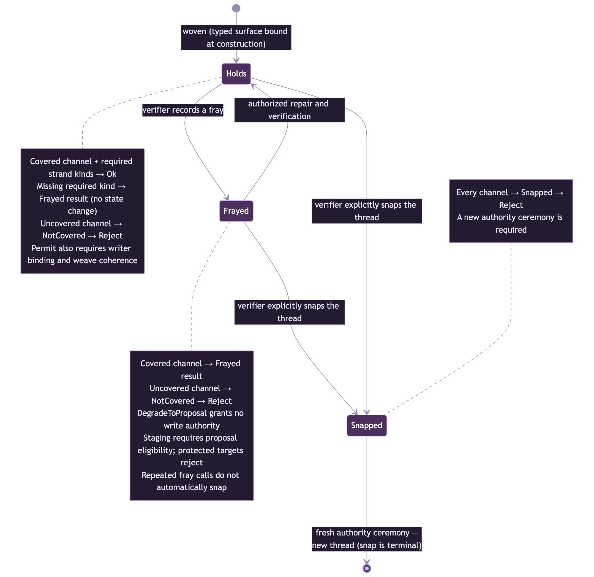

# Authority model

> Status: the Phase-0 verdict and tension contracts are frozen in `specs/PHASE-0-DESIGN.md` §1, §5 (v0.2, 2026-07-14) and implemented in `coven-threads-core`. Coven `v0.4.3` includes the earlier daemon integration. Release inclusion does not establish complete runtime conformance; see [the delivery ledger](phases.md) for unresolved Phase-5 findings.

Vocabulary (bound in [concepts.md](concepts.md)): a **Thread** is an authority relationship *surface → writer*; a **Weave** is the enforced pattern of threads; a **Strand** is a fiber inside a thread; a **Channel** is the axis of load a thread must hold under.

## Fail-closed is a conformance requirement, not a feature

This is the first substantive sentence of the frozen design doc, and it belongs first here too.

RFC-0001 §5.4 defines four enforcement gates. Gate 4 — the final canonical diff check immediately before a proposal is applied — is *the real security boundary*; Gates 1–3 are defense-in-depth. And the RFC is explicit:

> *"Gate 4 MUST NOT be skippable. An implementation that allows Gate 4 to be bypassed DOES NOT conform to this RFC."*

So fail-closed is not a hardening milestone coven-threads reaches in some later phase, and it is not a feature you can toggle. **An implementation with a bypassable Gate 4 is not a nonconforming-but-working implementation; it is not an implementation of RFC-0001 at all.** The design doc states this at line one (§1), by Nova non-negotiable, precisely so nobody schedules it as "Phase-1 hardening."

Concretely, fail-closed means every *unknown* resolves to rejection (design doc §5):

- Unknown surface path → **Reject**.
- A protected surface with no thread bound to it → **Reject**. (All protected surfaces MUST have threads; a missing thread is a configuration failure, not permission.)
- Unknown channel → **Reject**.
- Validator panic → the daemon catches it and treats it as **Reject** with a diagnostic.
- Any path that would bypass a gate → non-conformant, and rejected at compile time via the type system where possible.

There is no code path from "the validator doesn't know what this is" to "the write happens."

## The three verdicts

Every mutation request that reaches the gate resolves to one of three outcomes: permit, degrade to a proposal, or reject. A degradation is not permission to write, and the applicable approval ceremony is separate from the verdict.

### Permit

The writer is bound to the surface, the thread holds under the request's channel, and the weave's predicate permits authority at that surface, including any required identity context. The daemon may then apply through the applicable authority path and audit the outcome. A library verdict is not itself a filesystem write.

### DegradeToProposal

The thread reports a **fray**, either from its stored tension or from a missing structural strand requirement. No write occurs on this verdict. For proposal-eligible targets, the daemon may stage a proposal in `~/.coven/pending/` and surface the required ceremony. Proposals touching protected surfaces MUST instead be rejected; principal-authorized protected updates use a separate audited authority path.

Two properties worth stating plainly:

- Degradation is *graceful refusal*, not partial permission. Nothing is written to the protected surface, ever, on this path.
- A staged proposal is **data, not authority**. Replaying it later still goes back through `validate_fail_closed`; staging never becomes a bypass around Gate 4. If the thread has snapped in the meantime, the replay is rejected like anything else.

**Phase 5 adds typed approval semantics** (active, not frozen; decision record: `specs/PHASE-5-APPROVAL-SEMANTICS.md`). At intake, daemon classification assigns an **`ApprovalPath`** to proposal-eligible targets. Windowed proposals remain pending until the deadline and minimum-visible floor are satisfied, then require matching live evidence replay and no veto before apply. `AutoRegression { veto: None }` has no veto period. `HumanApproval` and `HumanApprovalWithRationale` wait for explicit approval rather than a window deadline. Every path still requires final live revalidation; these are contract requirements, not a claim that the outstanding daemon findings are closed. See [the approval flow and audit lifecycle](architecture.md#phase-5-approval-semantics-and-delayed-apply).

### Reject

The mutation must not happen: the thread snapped, no thread exists, the surface or channel is unknown, or the validator itself failed. A rejection always carries a named reason, because every rejection is appended to `ward.audit` and an audit entry that says "no, for reasons" is useless. The reject reasons are typed (unknown surface, snapped thread, degraded weave, channel not covered, validator failure), so the audit trail stays machine-legible.

## The thread tension state machine

*Tension transitions: Holds ↔ Frayed → Snapped. The sketch is not the complete verdict rule; writer binding, channel coverage, required strands, and weave coherence also matter. Frayed is repairable in place; Snapped requires a fresh authority ceremony.*

A thread's **tension** is its current standing under load. Three states:

### Holds

The thread has no recorded fray or snap. `Permit` still requires writer binding, channel coverage, structural strand requirements, and acceptable contextual weave coherence at the target surface.

### Frayed

One strand failed, but the thread has not snapped. Fraying is the deliberately-engineered *intermediate* state — it exists so that failure is legible and gradual rather than binary and opaque. A frayed thread records which strand failed, on which channel, why, and when — so the operator sees *"thread frayed at strand `ContentHash` — SOUL.md hash mismatch, detected on channel `Forced`"* rather than a bare alarm.

Two hard requirements attach to fraying:

- **Frayed threads MUST surface to the operator** (design doc §2.3). Fraying is never silent.
- A frayed thread yields **`DegradeToProposal`** on a covered channel. An uncovered channel rejects. Proposal eligibility and the required approval ceremony remain separate daemon checks; protected targets cannot enter the proposal pipeline.

**Repair path:** a fray is repairable *in place*. The daemon must restore and verify the failed commitment through the applicable authority path before recording **Holds**. For example, it may restore a tampered surface from authoritative source or recommit a hash after a legitimate authorized write. Repair I/O is daemon-owned; the crate does not automatically restore bytes or clear tension when a hash matches.

### Snapped

Terminal severance. The thread no longer carries authority, and mutations against it yield **Reject**. When a thread snaps:

- The weave is marked **degraded at that thread's surface** — and it reports *which* surface, not just "something is wrong."
- The broken surface becomes **read-only until repair**.
- The familiar **continues operating on its other surfaces**. A snapped thread on one surface does not brick the familiar; it quarantines the one surface whose authority state is no longer trustworthy.

**Repair path:** unlike a fray, a snap cannot be repaired in place. Recovering a snapped thread requires a **fresh authority ceremony** — deliberately re-establishing the authority relationship (new thread construction with new strand commitments), under principal authority, rather than patching the old one. The asymmetry is intentional: if a thread's authority contract failed badly enough to snap, "quietly fix it and resume" is exactly the wrong affordance.

The daemon verifier records a fray or explicitly snaps the thread according to its failure policy. The core does not count strand failures or turn repeated `fray` calls into a snap. Once snapped, the thread cannot be restored by `fray`.

## How tension contributes to the verdict

Tension contributes to the verdict but does not determine it alone:

| Condition | Verdict on mutation | Next step |
|---|---|---|
| Bound writer, covered channel, required strands present, thread holds, predicate accepts | `Permit` | Daemon performs the authorized write and audits |
| Bound writer and covered channel, with a fray or missing required strand kind | `DegradeToProposal` | Daemon checks proposal eligibility and required ceremony; no direct write |
| Snapped, unbound writer, unknown surface, uncovered channel, or failed predicate | `Reject` | Resolve the named failure through the applicable authority path |

The validator computes the verdict from the request and authoritative weave state. The daemon owns effects and audit writes; neither stored tension nor a staged proposal can bypass the remaining authority checks.

## Where to go next

- What each channel demands of strands (and hence what can fray): [channels-and-strands.md](channels-and-strands.md)
- Where the verdicts flow and land in `ward.audit`: [architecture.md](architecture.md)
