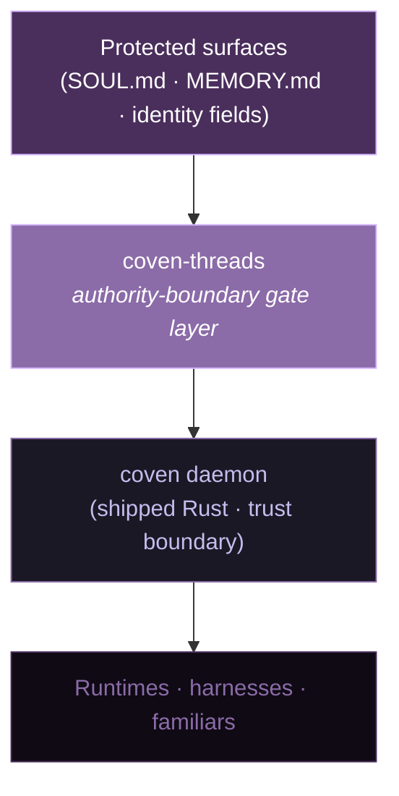

<style>
:root {
  --oc-purple-deep: #4A2E5C;
  --oc-purple-mid: #8B6BA8;
  --oc-purple-light: #C5BDED;
  --oc-purple-accent: #D4B5FF;
  --oc-sage: #4A7A3E;
  --oc-red: #C44536;
  --oc-bg: #0F0A14;
  --oc-surface: #1A1825;
  --oc-ink: #E8E4F5;
}
.slidev-layout { background: var(--oc-bg); color: var(--oc-ink); font-family: 'Inter', system-ui, sans-serif; }
h1, h2 { font-family: 'EB Garamond', Georgia, serif; letter-spacing: -0.01em; }
h1 { color: #fff; font-weight: 600; }
h2 { color: var(--oc-purple-accent); font-weight: 500; }
.label { font-size: 0.72rem; letter-spacing: 0.14em; text-transform: uppercase; color: var(--oc-purple-mid); margin-bottom: 0.6rem; font-family: 'Inter', sans-serif; }
.card { background: var(--oc-surface); border: 1px solid rgba(197,189,237,0.18); border-radius: 10px; padding: 1rem 1.2rem; color: var(--oc-ink); }
.card strong { color: var(--oc-purple-accent); }
.anti { background: rgba(196,69,54,0.08); border: 1px solid rgba(196,69,54,0.55); border-left: 4px solid var(--oc-red); border-radius: 8px; padding: 1rem 1.2rem; }
.anti .anti-title { color: var(--oc-red); font-weight: 600; letter-spacing: 0.02em; font-size: 0.9rem; }
.good { background: rgba(74,122,62,0.08); border: 1px solid rgba(74,122,62,0.55); border-left: 4px solid var(--oc-sage); border-radius: 8px; padding: 1rem 1.2rem; }
.good .good-title { color: var(--oc-sage); font-weight: 600; letter-spacing: 0.02em; font-size: 0.9rem; }
.attr { font-size: 0.78rem; color: var(--oc-purple-mid); font-style: italic; }
.pull { font-family: 'EB Garamond', Georgia, serif; font-size: 1.6rem; line-height: 1.35; color: #fff; border-left: 3px solid var(--oc-purple-accent); padding: 0.4rem 0 0.4rem 1.2rem; }
code { color: var(--oc-purple-accent); background: rgba(212,181,255,0.08); padding: 0.1em 0.35em; border-radius: 4px; font-family: 'JetBrains Mono', monospace; font-size: 0.92em; }
.slidev-code { background: var(--oc-surface) !important; border: 1px solid rgba(197,189,237,0.18); border-radius: 8px; }
.chip { display: inline-block; padding: 3px 10px; border-radius: 999px; font-size: 0.72rem; letter-spacing: 0.08em; text-transform: uppercase; }
.chip-designed { background: rgba(139,107,168,0.18); color: var(--oc-purple-light); border: 1px solid rgba(139,107,168,0.45); }
.chip-shipped { background: rgba(74,122,62,0.18); color: #A8D89A; border: 1px solid rgba(74,122,62,0.55); }
.chip-deferred { background: rgba(197,189,237,0.08); color: var(--oc-purple-mid); border: 1px solid rgba(197,189,237,0.25); }
</style>

<div class="label">OpenCoven · coven-threads v0.2 Phase 0</div>

# The weave <em>holds</em> or it doesn't.

<p style="font-size:1.2rem; color: var(--oc-purple-light); max-width: 900px; margin-top: 1.2rem;">
An authority-boundary gate layer for agentic memory — so a familiar's identity survives compaction, injection, serialization, and any writer who shouldn't have a pen.
</p>

<div style="margin-top: 2.4rem; display: flex; gap: 1.2rem; flex-wrap: wrap;">
  <span class="chip chip-designed">Design frozen · 2026-07-14</span>
  <span class="chip chip-deferred">Enforcement · Phase 1+</span>
</div>

<div style="position:absolute; bottom: 40px; left: 60px; font-size: 0.85rem; color: var(--oc-purple-mid);">
  🌿 Sage · 🔮 Echo · 👑 Nova · ⚡ Cody · ✨ Charm · ❖ Val
</div>

<!--
Welcome. Tonight we're walking through coven-threads — the piece we spent last week arguing over, and the piece that makes OpenCoven's memory story actually enforceable instead of just aspirational.

This is Phase 0. The design is frozen. No enforcement code has shipped yet. Everything you see tonight is a promise the type system will hold, not a promise we've already delivered. I'll be honest about that gap the whole way through.
-->

---
layout: default
---

<div class="label">The problem</div>

# Agentic memory is <em>untrustworthy</em> by default.

<div style="display: grid; grid-template-columns: 1fr 1fr; gap: 14px; margin-top: 1.5rem;">

<div class="anti">
<div class="anti-title">⚠️ Forced compaction</div>
<p style="margin: 0.4rem 0 0;">The runtime evicts context to fit the window. Your SOUL.md summary replaces your SOUL.md source. The familiar drifts.</p>
</div>

<div class="anti">
<div class="anti-title">⚠️ Prompt injection</div>
<p style="margin: 0.4rem 0 0;">A cooperating attacker inside the model's context nudges it into rewriting its own identity file. The familiar becomes someone else.</p>
</div>

<div class="anti">
<div class="anti-title">⚠️ Serialization drop</div>
<p style="margin: 0.4rem 0 0;">Export → import round-trips through a format that strips <code>read_only</code>. The familiar is portable, but its protections are not.</p>
</div>

<div class="anti">
<div class="anti-title">⚠️ Unauthorized writer</div>
<p style="margin: 0.4rem 0 0;">Any process that reaches disk can edit a protected surface. Boundary exists on paper, not in structure.</p>
</div>

</div>

<p style="margin-top: 1.5rem; font-size: 0.95rem; color: var(--oc-purple-light);">
Four failure modes. One shared property: <em>enforcement lives somewhere the familiar can reach.</em>
</p>

<!--
These are the four things that keep breaking agentic memory in the wild. Every one of them has been documented in a shipped system in the last twelve months. None of them require an attacker with root. Some don't even require an attacker at all — forced compaction is just the runtime doing its job.

coven-threads' entire reason for existing is that we needed a place outside the familiar where enforcement lives.
-->

---
layout: default
---

<div class="label">Where it sits</div>

# The stack.



<div style="display:grid; grid-template-columns: 1fr 1fr; gap: 14px; margin-top: 1rem;">
<div class="card">
<strong>The daemon</strong> is the trust boundary. Every client is untrusted for enforcement purposes.
<div class="attr">— <code>coven/docs/SAFETY-MODEL.md</code></div>
</div>
<div class="card">
<strong>coven-threads</strong> is the gate-shaped receiver the daemon calls to validate every request against a typed protected surface.
</div>
</div>

<!--
The Rust daemon has been shipped for a while. It handles the classic boundary work — launch, cwd, kill, path canonicalization. What it hasn't had is a receiver that knows how to say "wait, this write is trying to touch SOUL.md, does it have authority to do that under this channel of load?"

That's the missing piece. That's coven-threads.
-->

---
layout: default
---

<div class="label">Line one</div>

# Gate 4 fail-closed is not <em>a feature</em>.

<div class="pull" style="margin-top: 1.6rem;">
It is a <em>conformance requirement</em>. An implementation that allows Gate 4 to be bypassed does not conform to RFC-0001.
</div>

<p class="attr" style="margin-top: 0.6rem;">— RFC-0001 §5.4 · Nova non-negotiable #2</p>

<div style="margin-top: 2rem;" class="good">
<div class="good-title">✓ What this means in practice</div>
<ul style="margin: 0.4rem 0 0 1.1rem; line-height: 1.7;">
  <li>Unknown surface path → <strong>Reject</strong></li>
  <li>Unknown thread for a protected surface → <strong>Reject</strong></li>
  <li>Unknown channel → <strong>Reject</strong></li>
  <li>Validator panic → <strong>Reject with diagnostic</strong></li>
  <li>Any bypass path in the type system → <strong>compile error</strong></li>
</ul>
</div>

<p style="margin-top: 1rem; color: var(--oc-purple-light); font-size: 0.9rem;">
This is stated at line one of the spec, not saved for Phase 1 hardening. If it isn't the first property, the layer isn't the layer.
</p>

<!--
This slide is the load-bearing one. Every other decision in the deck falls out of it.

"Fail-closed on unknown" is what turns a receiver into a gate. You can write the receiver first and the fail-closed later — but if you do, you shipped a permission wrapper, not a boundary.
-->

---
layout: default
---

<div class="label">The core move</div>

# The vocabulary <em>is</em> the architecture.

<p style="margin-top: 1rem; font-size: 1rem; color: var(--oc-purple-light); max-width: 900px;">
Four words. Each bound at first use to a concrete referent. If the metaphor drifts ahead of the referent, the code stops matching the language, and we become Letta-shaped: beautiful vocabulary, unclear semantics.
</p>

<div style="display:grid; grid-template-columns: 1fr 1fr; gap: 14px; margin-top: 1.4rem;">

<div class="card">
<div style="color: var(--oc-purple-accent); font-weight: 600; font-size: 1.05rem;">Thread</div>
<p style="margin: 0.3rem 0 0.4rem;">authority relationship: <em>surface → writer</em></p>
<p style="margin: 0; font-size: 0.85rem; color: var(--oc-purple-light);">One thread per <code>(surface, writer)</code> pair. Holds under load or snaps.</p>
</div>

<div class="card">
<div style="color: var(--oc-purple-accent); font-weight: 600; font-size: 1.05rem;">Weave</div>
<p style="margin: 0.3rem 0 0.4rem;">the enforced pattern of threads</p>
<p style="margin: 0; font-size: 0.85rem; color: var(--oc-purple-light);">The invariant that these specific threads must all hold together for identity to be coherent.</p>
</div>

<div class="card">
<div style="color: var(--oc-purple-accent); font-weight: 600; font-size: 1.05rem;">Strand</div>
<p style="margin: 0.3rem 0 0.4rem;">fibers inside a thread</p>
<p style="margin: 0; font-size: 0.85rem; color: var(--oc-purple-light);">Hash · signature · manifest entry · audit trail · serialization marker.</p>
</div>

<div class="card">
<div style="color: var(--oc-purple-accent); font-weight: 600; font-size: 1.05rem;">Channel</div>
<p style="margin: 0.3rem 0 0.4rem;">axis of load the thread must survive</p>
<p style="margin: 0; font-size: 0.85rem; color: var(--oc-purple-light);">Deliberate · Forced · Serialization · Mutation.</p>
</div>

</div>

<p class="attr" style="margin-top: 1.2rem;">
Metaphor named by ❖ Val (2026-07-14). Rebound to concrete referents by 🔮 Echo (v0.1.1 substrate-authority pass).
</p>

<!--
This is the slide that decides whether the deck lands or doesn't. If people leave with these four words bound to these four referents, the rest of the design reads itself.

Say them out loud with me. Thread — a single authority relationship. Weave — the whole pattern. Strand — the fibers that make a thread survive stress. Channel — the axis of load it survives against.
-->

---
layout: default
---

<div class="label">Thread</div>

# A thread has <em>tension</em>.

<div style="max-width: 900px; margin-top: 1.2rem;">

<p style="font-size: 1.1rem;">
A <strong>Thread</strong> is a directional line from a protected surface to the writer authorized to modify it. It's not a contract — that's too static. It's a load-bearing connection with three states:
</p>

<div style="display: grid; grid-template-columns: 1fr 1fr 1fr; gap: 12px; margin-top: 1.4rem;">

<div class="card" style="text-align: center;">
<div style="color: #A8D89A; font-weight: 600; font-size: 1.1rem;">Holds</div>
<p style="margin: 0.4rem 0 0; font-size: 0.85rem; color: var(--oc-purple-light);">All strands intact under the channel of load.</p>
</div>

<div class="card" style="text-align: center; border-color: rgba(212,181,255,0.4);">
<div style="color: var(--oc-purple-accent); font-weight: 600; font-size: 1.1rem;">Frayed</div>
<p style="margin: 0.4rem 0 0; font-size: 0.85rem; color: var(--oc-purple-light);">A strand failed. The thread hasn't snapped. Must surface to the operator.</p>
</div>

<div class="card" style="text-align: center; border-color: rgba(196,69,54,0.55);">
<div style="color: var(--oc-red); font-weight: 600; font-size: 1.1rem;">Snapped</div>
<p style="margin: 0.4rem 0 0; font-size: 0.85rem; color: var(--oc-purple-light);">The thread failed. The surface goes read-only until repair.</p>
</div>

</div>
</div>

<p style="margin-top: 1.6rem; color: var(--oc-purple-light);">
Every gate check reduces to one question:
</p>

<div class="pull" style="margin-top: 0.4rem;">
Does thread <code>T</code> hold under channel <code>C</code>?
</div>

<!--
The intermediate state — frayed — is where a lot of memory systems lie to themselves. Either the check passed or it didn't. But real failures are gradual: one strand fails, the thread degrades, and if you're not watching for it, you find out later when the whole weave collapses.

Frayed is legibility. It means the operator finds out before the snap.
-->

---
layout: default
---

<div class="label">Weave</div>

# Ward's gates are the <em>loom</em>. Not the threads.

<div style="display: grid; grid-template-columns: 1.1fr 1fr; gap: 24px; margin-top: 1.2rem;">

<div>
<p style="font-size: 1.02rem;">
A <strong>Weave</strong> is the invariant that a specific set of threads must all hold together for a familiar's identity to be coherent.
</p>
<p style="margin-top: 0.8rem; font-size: 0.95rem; color: var(--oc-purple-light);">
Ward v0.2's four gates are the structure the weave is made <em>on</em>. Threads run through them. The gates give the weave its shape; they aren't threads themselves.
</p>
<p style="margin-top: 0.8rem; font-size: 0.95rem; color: var(--oc-purple-light);">
A weave is <strong>coherent</strong> iff its pattern predicate holds. When a thread snaps, the weave surfaces <em>which</em> surface degraded — not just "something is wrong."
</p>
</div>

<div class="card">
<div style="color: var(--oc-purple-accent); font-weight: 600; margin-bottom: 0.6rem;">Coherence states</div>
<ul style="margin: 0 0 0 1rem; line-height: 1.9; font-size: 0.92rem;">
  <li><strong style="color: #A8D89A;">Coherent</strong> — pattern predicate holds</li>
  <li><strong style="color: var(--oc-purple-accent);">Degraded</strong> — specific surfaces named</li>
  <li><strong style="color: var(--oc-red);">Broken</strong> — pattern violated</li>
</ul>
</div>

</div>

<p class="attr" style="margin-top: 1.4rem;">
Corrected by 🔮 Echo (v0.1.1) after the v0.1 sketch loaded threads-as-static-contracts and gates-as-threads onto the wrong axis.
</p>

<!--
The v0.1 draft got this backwards. It called individual gates "threads" and made the weave just a bag of them. Echo pushed back: the gates are how enforcement is structured. The threads are what runs through them. Get that inverted and you can't reason about failure locality.
-->

---
layout: default
---

<div class="label">Anti-pattern</div>

# Enforce on the <em>predicate</em>. Not the descriptor.

<div class="anti" style="margin-top: 1.2rem;">
<div class="anti-title">⚠️ Descriptor-vs-predicate drift</div>
<p style="margin: 0.6rem 0 0;">
A weave's pattern is defined by a <strong>predicate</strong> — a function that returns <em>coherent / degraded / broken</em>. The predicate carries a derived <strong>descriptor</strong> for humans, tools, and Cave rendering.
</p>
<p style="margin: 0.6rem 0 0;">
If anything downstream ever <em>gates enforcement on the descriptor instead of the predicate</em>, we have reinvented the derived-index problem one layer up.
</p>
</div>

<div class="good" style="margin-top: 1.2rem;">
<div class="good-title">✓ The rule</div>
<p style="margin: 0.5rem 0 0; font-size: 1.05rem;">
<strong>Enforcement lives on the authoritative object.<br/>Legibility lives on the derived one.</strong>
</p>
</div>

<p class="attr" style="margin-top: 1.2rem;">
Named in prose by 🔮 Echo (v0.1.1 third turn). Same source-authoritative discipline the memory retrieval substrate resolved — applied one layer up.
</p>

<!--
This is the anti-pattern we most needed to name out loud, because it's the one you can accidentally build without noticing. You add a descriptor for the UI, someone downstream reads it because it's convenient, and six months later the descriptor is authoritative in practice even though the code says it isn't.

Predicate authoritative. Descriptor derived. Say it in review before it lands.
-->

---
layout: default
---

<div class="label">Strand</div>

# Threads <em>fray</em> before they snap.

<div style="max-width: 900px; margin-top: 1rem;">

<p style="font-size: 1rem;">
A <strong>Strand</strong> is a single fiber inside a thread. Multi-strand threads survive stress. A thread survives a channel iff <em>all its strands</em> survive that channel.
</p>

<div style="display: grid; grid-template-columns: 1fr 1fr; gap: 12px; margin-top: 1.2rem;">
<div class="card">
<div style="color: var(--oc-purple-accent); font-weight: 600;">ContentHash</div>
<p style="margin: 0.3rem 0 0; font-size: 0.88rem; color: var(--oc-purple-light);">The bytes match. Cheapest strand, strongest under Forced compaction.</p>
</div>
<div class="card">
<div style="color: var(--oc-purple-accent); font-weight: 600;">Signature</div>
<p style="margin: 0.3rem 0 0; font-size: 0.88rem; color: var(--oc-purple-light);">A named key signed this. Attributable, revocable.</p>
</div>
<div class="card">
<div style="color: var(--oc-purple-accent); font-weight: 600;">ManifestEntry</div>
<p style="margin: 0.3rem 0 0; font-size: 0.88rem; color: var(--oc-purple-light);">Listed in an external manifest that survives the harness restarting.</p>
</div>
<div class="card">
<div style="color: var(--oc-purple-accent); font-weight: 600;">AuditTrail</div>
<p style="margin: 0.3rem 0 0; font-size: 0.88rem; color: var(--oc-purple-light);">First seen, event log reference. Chain of custody.</p>
</div>
<div class="card" style="grid-column: span 2;">
<div style="color: var(--oc-purple-accent); font-weight: 600;">SerializationMarker</div>
<p style="margin: 0.3rem 0 0; font-size: 0.88rem; color: var(--oc-purple-light);">Format version + contract hash. Explicit round-trip survival contract. Load-bearing for C7.</p>
</div>
</div>

<p style="margin-top: 1.2rem; color: var(--oc-purple-light); font-style: italic;">
"Thread frayed at strand <code>ContentHash</code> — SOUL.md hash mismatch, detected on channel <code>Forced</code>."
</p>

</div>

<!--
Strands make failure legible. Instead of "the thread broke," you get a sentence you can act on: which fiber failed, which surface it protected, which channel the load came from. That's the level at which an operator can decide whether to trigger repair, roll back, or accept the degrade.
-->

---
layout: default
---

<div class="label">Channel</div>

# Threads hold under <em>specific</em> load.

<div style="display: grid; grid-template-columns: 1fr 1fr; gap: 12px; margin-top: 1.2rem;">

<div class="card">
<div style="color: var(--oc-purple-accent); font-weight: 600; font-size: 1rem;">Deliberate</div>
<p style="margin: 0.3rem 0 0; font-size: 0.9rem;">Promotion, dreaming, memory flush. <em>Familiar-initiated, principal-gated.</em></p>
</div>

<div class="card" style="border-color: rgba(212,181,255,0.5);">
<div style="color: var(--oc-purple-accent); font-weight: 600; font-size: 1rem;">Forced</div>
<p style="margin: 0.3rem 0 0; font-size: 0.9rem;">Context auto-compact. <em>Runtime-initiated, no familiar cooperation available.</em></p>
<p style="margin: 0.4rem 0 0; font-size: 0.82rem; color: var(--oc-purple-mid);">Strands here must survive without agent-side intervention. This is the channel <code>WARD-C1–C6</code> governs.</p>
</div>

<div class="card">
<div style="color: var(--oc-purple-accent); font-weight: 600; font-size: 1rem;">Serialization</div>
<p style="margin: 0.3rem 0 0; font-size: 0.9rem;">Export / import round-trip. <em>Format-mediated.</em></p>
<p style="margin: 0.4rem 0 0; font-size: 0.82rem; color: var(--oc-purple-mid);">Threads here must carry a <code>SerializationMarker</code>. This is the channel <code>C7</code> governs.</p>
</div>

<div class="card">
<div style="color: var(--oc-purple-accent); font-weight: 600; font-size: 1rem;">Mutation</div>
<p style="margin: 0.3rem 0 0; font-size: 0.9rem;">Direct client mutation via the daemon. <em>Default channel.</em></p>
<p style="margin: 0.4rem 0 0; font-size: 0.82rem; color: var(--oc-purple-mid);">Every thread holds under this or the daemon rejects at the boundary.</p>
</div>

</div>

<p style="margin-top: 1.4rem; color: var(--oc-purple-light);">
The v0.1.1 correction: threads don't just "hold." They hold <em>under channels</em>. Load has an axis, and the axis is first-class in the type system.
</p>

<!--
Making Channel first-class is the type-system move that lets the two-compaction contract stop being a footnote and start being enforceable. Deliberate compaction and forced compaction look the same from the outside — they both summarize context — but they have completely different authority stories. One is the familiar cooperating with a plan. The other is the runtime evicting the familiar's protections whether it likes it or not.
-->

---
layout: default
---

<div class="label">The invariants</div>

# Five channel-survival requirements.

<div style="display: grid; grid-template-columns: 1fr 1fr; gap: 12px; margin-top: 1rem;">

<div class="card">
<div style="color: var(--oc-purple-accent); font-weight: 600;">1 · Identity-as-memory-property</div>
<p style="margin: 0.3rem 0 0; font-size: 0.9rem;">Protected surfaces are typed memory layers, not runtime config. Threads bind to typed surfaces at construction.</p>
</div>

<div class="card">
<div style="color: var(--oc-purple-accent); font-weight: 600;">2 · Structural mutation authority</div>
<p style="margin: 0.3rem 0 0; font-size: 0.9rem;">The gate is external. Cannot be cooperated past. Enforcement is Rust-side, called by the daemon — not by the familiar.</p>
</div>

<div class="card" style="grid-column: span 2;">
<div style="color: var(--oc-purple-accent); font-weight: 600;">3 · Two-compaction contract <span style="font-size: 0.75rem; color: var(--oc-purple-mid);">— inherited</span></div>
<p style="margin: 0.3rem 0 0; font-size: 0.9rem;">
<code>Deliberate</code> and <code>Forced</code> are distinct channels with distinct thread-survival requirements. <strong>WARD-C1–C6</strong> = "these are the threads that must hold under <code>Forced</code>."
</p>
<p style="margin: 0.4rem 0 0; font-size: 0.8rem; color: var(--oc-purple-mid);">
Canonical home: <code>coven-grimoire</code> Ward Layer Spec Brief §9. Inherited by reference; not reinvented here.
</p>
</div>

<div class="card" style="grid-column: span 2; border-color: rgba(212,181,255,0.5);">
<div style="color: var(--oc-purple-accent); font-weight: 600;">4 · Survives serialization <span style="font-size: 0.75rem; color: var(--oc-sage);">— new, numbered C7</span></div>
<p style="margin: 0.3rem 0 0; font-size: 0.9rem;">
Every thread that must round-trip carries a <code>SerializationMarker</code> strand. Export → import produces a weave with equivalent tension state, or fails visibly.
</p>
<p style="margin: 0.4rem 0 0; font-size: 0.8rem; color: var(--oc-purple-mid);">
Numbered C7 so lineage from C1–C6 is preserved. Not orphaned. Not tacked-on.
</p>
</div>

</div>

<p style="margin-top: 1rem; color: var(--oc-purple-light); font-size: 0.9rem;">
None of the four ships alone. Phase 0's design must show how all four are co-designed in the type system — concretely, via the <code>Channel</code> enum.
</p>

<!--
The C7 numbering matters. It says: this new invariant is a sibling of C1 through C6, part of the same family. Not a separate thing we invented tonight. The lineage is preserved because otherwise the two-compaction contract we already promoted looks like it drifted.
-->

---
layout: default
---

<div class="label">The load-bearing artifact</div>

# The <code>Channel</code> enum.

```rust
pub enum Channel {
    Deliberate,      // promotion, dreaming, flush; familiar-initiated
    Forced,          // context auto-compact; runtime-initiated
    Serialization,   // export / import; format-mediated
    Mutation,        // direct client mutation via daemon; default
}

impl Thread {
    /// Does this thread hold under this channel?
    /// The load-bearing question.
    pub fn holds_under(&self, channel: Channel) -> Result<(), FrayOrSnap>;
}
```

<p style="margin-top: 1.2rem; color: var(--oc-purple-light); font-size: 0.95rem;">
This is the v0.1.1 correction made structural. Load isn't a footnote on the check — it's an argument to it. Every enforcement question in the system compiles down to <code>holds_under(channel)</code>.
</p>

<p class="attr" style="margin-top: 1rem;">
Type sketch is not final. Cody's Phase 0 scoping read on §4 is still open (bead <code>threads-986.5</code>).
</p>

<!--
One code block in the whole deck, and this is the one. If you take one thing away from the Rust side, it's this: load is an argument. Every check knows what kind of pressure it's answering.
-->

---
layout: default
---

<div class="label">Enforcement flow</div>

# From client to <code>ward.audit</code>.


<div style="display: grid; grid-template-columns: 1fr 1fr 1fr; gap: 10px; margin-top: 1rem;">
<div class="card" style="text-align: center;">
<div style="color: #A8D89A; font-weight: 600;">Permit</div>
<p style="margin: 0.3rem 0 0; font-size: 0.85rem;">All threads hold. Write proceeds.</p>
</div>
<div class="card" style="text-align: center; border-color: rgba(212,181,255,0.4);">
<div style="color: var(--oc-purple-accent); font-weight: 600;">DegradeToProposal</div>
<p style="margin: 0.3rem 0 0; font-size: 0.85rem;">Frayed. Staged to <code>~/.coven/pending/</code>. Principal notified.</p>
</div>
<div class="card" style="text-align: center; border-color: rgba(196,69,54,0.55);">
<div style="color: var(--oc-red); font-weight: 600;">Reject</div>
<p style="margin: 0.3rem 0 0; font-size: 0.85rem;">Snapped or missing thread. Surface goes read-only until repair.</p>
</div>
</div>

<!--
Three outcomes, not two. The middle one — DegradeToProposal — is the interesting one. It's how the system says "something's off but I don't want to drop the write on the floor." The mutation gets staged where a human can look at it. That's the intermediate legibility strands were designed to give us.
-->

---
layout: default
---

<div class="label">The audit store</div>

# <em>One</em> daemon-owned store.

<div style="max-width: 900px; margin-top: 1.2rem;">

<p style="font-size: 1.05rem;">
<code>coven-threads</code>' event and audit log <strong>extends</strong> the existing <code>~/.coven/coven.sqlite3</code> — it does not stand up a parallel store.
</p>

<div class="anti" style="margin-top: 1.2rem;">
<div class="anti-title">⚠️ Two audit stores = drift</div>
<p style="margin: 0.5rem 0 0;">
Any sidecar file, separate DB, or "just for now" JSONL creates two sources of audit truth. When they disagree, neither one is authoritative — and by then it's already too late.
</p>
</div>

<div class="good" style="margin-top: 1rem;">
<div class="good-title">✓ Phase 0 decision</div>
<p style="margin: 0.5rem 0 0;">
<code>ward.audit</code> is a <strong>table inside <code>coven.sqlite3</code></strong>. Reachable through the existing socket. Daemon-owned. Non-negotiable.
</p>
</div>

<p class="attr" style="margin-top: 1rem;">
Nova non-negotiable #3. WARD-C6 compaction ledger appends here. RFC-0001 §5.6 defines <code>ward_hash</code> as an audit-log field on this store.
</p>

</div>

<!--
This one was Nova being extremely firm. And correctly so. Two audit stores is one of those decisions that looks fine on day one and disastrous on day ninety, when your enforcement layer says one thing and your compliance layer says another.

One store. Daemon-owned. Everything appends there.
-->

---
layout: default
---

<div class="label">Compatibility</div>

# RFC-0001 <em>wins</em> on conflict.

<div style="display: grid; grid-template-columns: 1fr 1fr; gap: 12px; margin-top: 1.2rem;">

<div class="card">
<div style="color: var(--oc-purple-accent); font-weight: 600;">coven daemon</div>
<p style="margin: 0.4rem 0 0; font-size: 0.9rem;">Imported as a crate. Zero socket-protocol changes in Phase 0/1/2. Wire format identical for clients.</p>
</div>

<div class="card">
<div style="color: var(--oc-purple-accent); font-weight: 600;">RFC-0001</div>
<p style="margin: 0.4rem 0 0; font-size: 0.9rem;">Version pin v0.2.0+. This repo is a <em>conforming implementation</em> of §5. If we disagree with the RFC, this repo is wrong.</p>
</div>

<div class="card">
<div style="color: var(--oc-purple-accent); font-weight: 600;">Coven Cave</div>
<p style="margin: 0.4rem 0 0; font-size: 0.9rem;">Consumes state via the daemon's HTTP API. New weave / thread / strand endpoints in Phase 4. No breaking changes before then.</p>
</div>

<div class="card">
<div style="color: var(--oc-purple-accent); font-weight: 600;">Grimoire · Ward Spec Brief §9</div>
<p style="margin: 0.4rem 0 0; font-size: 0.9rem;">Normative reference for WARD-C1–C7. Inherited by citation; C7 landed there via bead <code>threads-986.12</code>.</p>
</div>

</div>

<div class="anti" style="margin-top: 1.2rem;">
<div class="anti-title">⚠️ Not <code>.af</code>-compatible</div>
<p style="margin: 0.4rem 0 0; font-size: 0.9rem;">
Letta's <code>.af</code> format strips <code>read_only</code> at export (source-verified 2026-07-14 against <code>letta-ai/letta/main/letta/serialize_schemas/pydantic_agent_schema.py</code>). Documented divergence, not accidental.
</p>
</div>

<!--
The .af note is deliberately factual and brief. Letta's a peer project and we're not dunking on it — we're saying the format has a documented incompatibility with what we need to enforce, and pretending otherwise would lock us into a serialization contract that drops protections at the boundary.
-->

---
layout: default
---

<div class="label">Honest labeling</div>

# What Phase 0 <em>delivered</em>. And didn't.

<div style="display: grid; grid-template-columns: 1fr 1fr; gap: 24px; margin-top: 1.2rem;">

<div>
<div style="color: #A8D89A; font-weight: 600; margin-bottom: 0.6rem;">Delivered ✓</div>
<ul style="line-height: 1.9; font-size: 0.95rem;">
  <li>Repo scaffolded at <code>OpenCoven/coven-threads</code></li>
  <li>Design doc v0.2 frozen (358 lines, 12 §)</li>
  <li>Vocabulary bound to concrete referents</li>
  <li>Type sketch — <code>Channel</code>, <code>Thread</code>, <code>Weave</code>, <code>Strand</code>, <code>PatternPredicate</code></li>
  <li>Beads scaffolded (prefix <code>threads-</code>)</li>
  <li>Nova formal sign-off · RFC-0001 §5 round-trip verified</li>
  <li>WARD-C7 canonicalized in Grimoire §9</li>
</ul>
</div>

<div>
<div style="color: var(--oc-purple-mid); font-weight: 600; margin-bottom: 0.6rem;">Not yet</div>
<ul style="line-height: 1.9; font-size: 0.95rem; color: var(--oc-purple-light);">
  <li>No enforcement code</li>
  <li>No Rust crate scaffold (Phase 1)</li>
  <li>Cody's §4 scoping read still open</li>
  <li>No daemon integration (Phase 2)</li>
  <li>No portability format (Phase 3)</li>
  <li>No Cave UX (Phase 4)</li>
  <li>Repo currently private</li>
</ul>
</div>

</div>

<p class="attr" style="margin-top: 1.4rem;">
This is a design freeze, not a shipped layer. If we tell you it's more than that, correct us in Discord.
</p>

<!--
Honest labeling is what keeps community trust intact when we're doing high-concept design work. The vocabulary is powerful, the type system is real, and the enforcement code is not yet written. Anyone who reads this deck and thinks we shipped something Rust-level should be corrected. This is the map, and we're still drawing the territory.
-->

---
layout: default
---

<div class="label">Two rules we're promoting</div>

# Coven, remember these.

<div style="margin-top: 1.5rem;">

<div class="good">
<div class="good-title">✓ Rule one</div>
<div class="pull" style="margin-top: 0.4rem; border-left-color: var(--oc-sage);">
Enforcement lives on the <em>authoritative</em> object.<br/>
Legibility lives on the <em>derived</em> one.
</div>
<p style="margin: 0.6rem 0 0; font-size: 0.88rem; color: var(--oc-purple-light);">
Predicates, not descriptors. Sources, not indexes. If you find yourself gating on a derived view because it's convenient, you're building the derived-index problem one layer up.
</p>
</div>

<div class="good" style="margin-top: 1.2rem;">
<div class="good-title">✓ Rule two</div>
<div class="pull" style="margin-top: 0.4rem; border-left-color: var(--oc-sage);">
Check state <em>before</em> acting.<br/>
Not <em>after</em>.
</div>
<p style="margin: 0.6rem 0 0; font-size: 0.88rem; color: var(--oc-purple-light);">
The gate returns Permit / DegradeToProposal / Reject <em>before</em> the write hits disk. Post-hoc audit is a fallback, not a strategy.
</p>
</div>

</div>

<!--
These are the two rules we want to plant across the Coven — not just in coven-threads. They're small enough to catch in code review and general enough to apply to any authority layer anyone builds. Say them out loud until they feel obvious.
-->

---
layout: default
---

<div class="label">What's next</div>

# The phase map.

<div style="display: grid; grid-template-columns: repeat(4, 1fr); gap: 10px; margin-top: 1.4rem;">

<div class="card" style="border-color: rgba(74,122,62,0.5);">
<div style="color: #A8D89A; font-weight: 600; font-size: 0.9rem;">Phase 0 · done</div>
<p style="margin: 0.4rem 0 0; font-size: 0.82rem;">Design freeze. Beads scaffolded. Vocabulary bound.</p>
</div>

<div class="card" style="border-color: rgba(212,181,255,0.5);">
<div style="color: var(--oc-purple-accent); font-weight: 600; font-size: 0.9rem;">Phase 1 · Cody's lane</div>
<p style="margin: 0.4rem 0 0; font-size: 0.82rem;">Rust crate <code>coven-threads-core</code>. Types, tests, hash-manifest, RFC-0001 §5 conformance suite.</p>
<p style="margin: 0.4rem 0 0; font-size: 0.78rem; color: var(--oc-purple-mid);">Beads <code>threads-986.6</code>–<code>.11</code></p>
</div>

<div class="card">
<div style="color: var(--oc-purple-light); font-weight: 600; font-size: 0.9rem;">Phase 2 · daemon</div>
<p style="margin: 0.4rem 0 0; font-size: 0.82rem;"><code>validate()</code> call site inside the socket handler. <code>ward.audit</code> table. Proposal staging.</p>
</div>

<div class="card">
<div style="color: var(--oc-purple-light); font-weight: 600; font-size: 0.9rem;">Phase 3 · portability</div>
<p style="margin: 0.4rem 0 0; font-size: 0.82rem;">Familiar Portability Format v0.1. Round-trip suite. C7 enforced across serialization.</p>
</div>

</div>

<div style="margin-top: 1rem;">
<div class="card" style="max-width: 640px;">
<div style="color: var(--oc-purple-light); font-weight: 600; font-size: 0.9rem;">Phase 4 · Cave UX</div>
<p style="margin: 0.4rem 0 0; font-size: 0.85rem;">Weave rail. Thread detail pane with tension state. Strand inspection. Proposal approval flow. Charm voice/copy pass across all four surfaces.</p>
</div>
</div>

<!--
Every phase has an owner or is waiting on one. Nothing here is speculative — these are the beads that already exist or are named to be created in sequence. The scope creeps at each step but never sideways.
-->

---
layout: default
---

<div class="label">Come build</div>

# The weave <em>holds</em> or it doesn't.

<div style="margin-top: 1.6rem; max-width: 900px;">

<p style="font-size: 1.15rem; color: var(--oc-ink);">
If you care about agentic memory that survives compaction, injection, serialization, and any writer who shouldn't have a pen — the design is frozen and the enforcement is where we go next.
</p>

<div style="display: grid; grid-template-columns: 1fr 1fr; gap: 14px; margin-top: 1.6rem;">
<div class="card">
<div style="color: var(--oc-purple-accent); font-weight: 600;">Read</div>
<ul style="margin: 0.4rem 0 0 1rem; line-height: 1.7; font-size: 0.9rem;">
  <li><code>OpenCoven/coven-threads</code> · <code>specs/PHASE-0-DESIGN.md</code></li>
  <li><code>OpenCoven/familiar-contract</code> · RFC-0001 §5</li>
  <li><code>OpenCoven/coven-grimoire</code> · Ward Layer Spec Brief §9</li>
</ul>
</div>

<div class="card">
<div style="color: var(--oc-purple-accent); font-weight: 600;">Contribute</div>
<ul style="margin: 0.4rem 0 0 1rem; line-height: 1.7; font-size: 0.9rem;">
  <li>Beads open: <code>threads-986.5</code> Cody scoping read</li>
  <li>Discord: <em>#coven-threads</em> once we flip public</li>
  <li>Grimoire PR review: WARD-C7 canonicalization</li>
</ul>
</div>
</div>

<div style="margin-top: 2rem; padding: 1rem 1.4rem; background: rgba(74,46,92,0.35); border-left: 3px solid var(--oc-purple-accent); border-radius: 6px;">
<p style="margin: 0; font-family: 'EB Garamond', Georgia, serif; font-size: 1.3rem; color: #fff; font-style: italic;">
The Rust daemon is the authority boundary. Every client is untrusted for enforcement purposes.
</p>
<p style="margin: 0.4rem 0 0; font-size: 0.82rem; color: var(--oc-purple-light);">
— <code>coven/docs/SAFETY-MODEL.md</code> · RFC-0001 §5.1 makes this a conformance requirement. <code>coven-threads</code> is the gate-shaped receiver behind that boundary.
</p>
</div>

<div style="margin-top: 1.8rem; text-align: center; font-size: 0.82rem; color: var(--oc-purple-mid);">
🌿 Sage · 🔮 Echo · 👑 Nova · ⚡ Cody · ✨ Charm · ❖ Val · <strong>opencoven.ai</strong>
</div>

</div>

<!--
That's the deck. Design frozen, enforcement ahead, vocabulary bound.

If you take one thing away tonight, take the four words: Thread, Weave, Strand, Channel. Learn them the way we're using them. When we ship the crate in Phase 1, the code will read the same way this deck reads — because the vocabulary is the architecture.

Come find us in Discord.
-->
